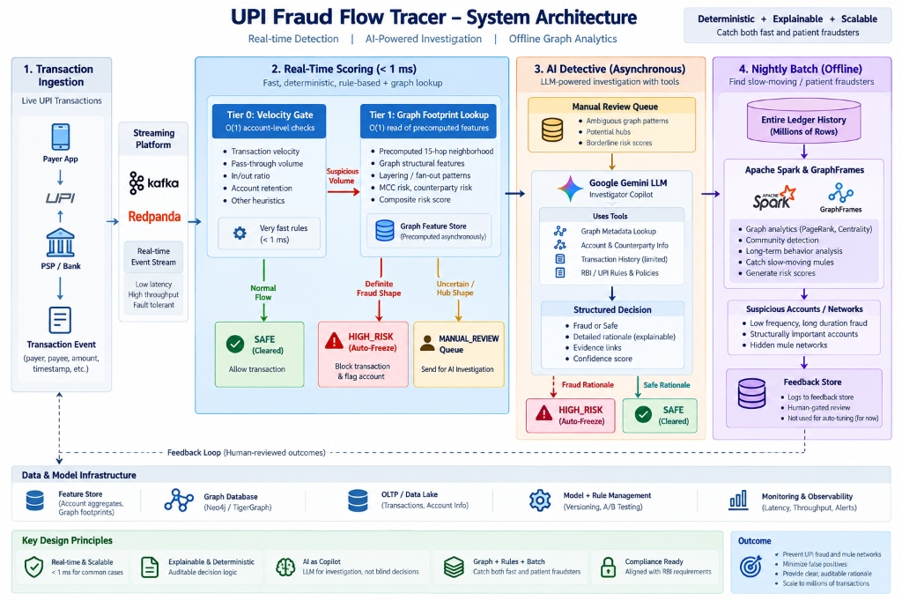
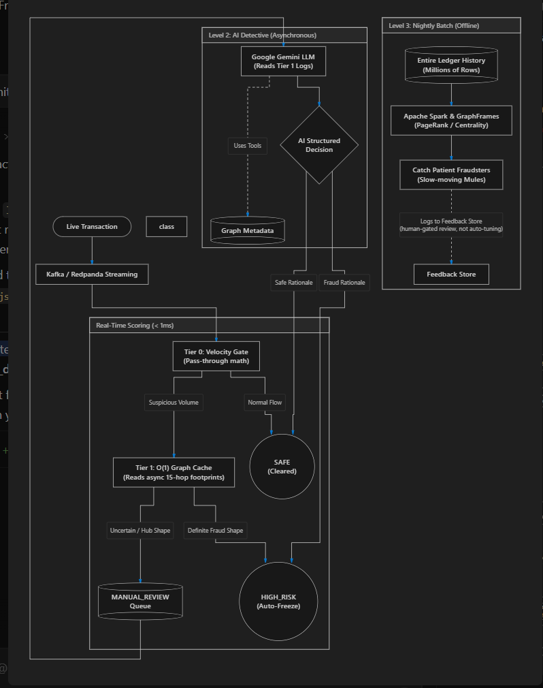
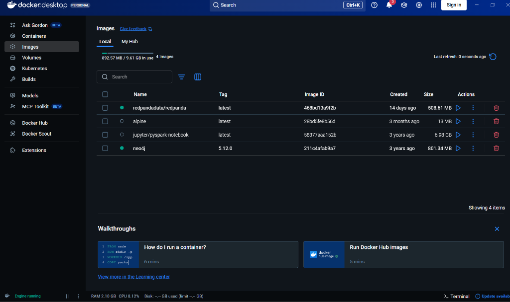

# UPI Fraud Flow Tracer (Mule Account Detector)

**Razorpay AI Buildathon 2026 - Track 2 (AI Risk Manager)**

This repository contains a defense-only UPI Fraud Flow Tracer. It detects mule account networks by reconstructing multi-hop transaction flows over a temporal graph. Designed for real-world compliance (e.g., RBI's MuleHunter.AI), it prioritizes explainability and the strict minimization of False Positives (protecting legitimate businesses from unfair account freezes).

---

## System Architecture




---

## Tech Stack
*   **Core Logic:** Python 3.11
*   **Infrastructure:** Docker (for Kafka/Redpanda streaming and Apache Spark batch analytics)
*   **Data Generation:** Pandas, Faker (Synthetic realistic data generation)
*   **Graph Engine:** NetworkX (In-memory topological tracing)
*   **Visualizations:** Matplotlib
*   **Testing:** Pytest
*   **No Black Boxes:** Explicitly avoided opaque Graph Neural Networks (GNNs) or heavy Graph Databases (Neo4j) to ensure regulatory explainability and low operational overhead.

---

## Project Memory: Phase-by-Phase Breakdown

This project was built incrementally:

### Phase 1: Synthetic Data Simulation (`src/simulator.py`)
*   **Implementation:** Generated 5,000 accounts and 29,000+ transactions over 90 days.
*   **Focus:** Realistic class imbalance (~3% mules). We engineered complex mule archetypes (Structuring, Split/Re-converge) and Hard Negatives (Salary Disbursers, Small Businesses, Dormant legit purchases).

### Phase 2 & 3: MVP Detector & Formal Evaluation (`src/evaluate.py`)
*   **Implementation:** A baseline rule engine checking for high "pass-through" velocity (>90% within 24h) and account dormancy (>30 days).
*   **Result:** High recall, but high False Positives, as it mistakenly froze legitimate Small Businesses and Payroll accounts.

### Phase 4: Temporal Graph Tracer (`src/tracer.py`)
*   **Implementation:** Added a Bidirectional Breadth-First Search (BFS). Reconstructs the entire chain within a 24-hour window. 
*   **Result:** By analyzing graph topology, the system recognized that legitimate SMBs have massive "fan-in/fan-out" topologies.

### Phase 5: Graceful Degradation & Audit (`src/audit.py`)
*   **Implementation:** Wrapped the engine in a `FraudRiskAuditor`. Injected corrupted data (missing timestamps/dates).
*   **Result:** The system degrades gracefully, outputting a `MANUAL_REVIEW_REQUIRED` decision inside a structured JSON audit log (`outputs/audit_log.json`) with plain-English explanations.

### Phase 6: Visualizations (`src/visualize.py`)
*   **Implementation:** Auto-generated the topological flow diagram and exported evaluation metric tables.

### Phase 7: Packaging & Testing (`tests/test_detector.py`)
*   **Implementation:** Wrote a `pytest` suite validating the core BFS tracer.

### Phase 8: Metadata Contextualization & Honest Evaluation (`src/model_v2.py`)
*   **Implementation:** Addressed methodological flaws in early evaluation versions. Re-generated data with probabilistic Merchant Category Codes (MCC) to simulate noise (e.g., compromised legitimate merchants). Re-split data into a strict 60/20/20 Train/Validation/Test split. Tuned weights exclusively on validation data.

### Phase 9: External Benchmark & Deterministic Hardening
*   **IBM AML Benchmark Testing:** Evaluated our deterministic engine against the 5-million-row, 400k-account IBM AML benchmark dataset (`HI-Small_Trans.csv`).
*   **15-Hop Deep Traversal:** Upgraded the BFS horizon from shallow 1-hop to an unbounded 15-hop traversal with early stopping. Captured the deep "Stack" layering typologies, increasing IBM total system recall to 73.99% (Precision: 1.65%) and Risk Containment recall to 54.12% (Precision: 1.86%).
*   **Device Identity Linkage:** Built deterministic entity resolution (`shared_device_count`), tuning threshold $N=3$ on validation to catch burner device swarms while safely preserving legitimate family-shared devices ($N=2$).
*   **Payment Format Safelisting:** Added an explainable down-weighting proxy for slow/reversible payment formats (Cheques/Credit Cards), yielding a **+15% relative precision improvement** on external benchmark traffic.
*   **Adversary Coverage Matrix:** Formally documented in [architecture.md](docs/architecture.md) all 11 covered typologies and known blind spots (e.g., Bipartite clearing house mimicry and gradual graduation).


---

## Evaluation & Metrics (Final Production Run)

We explicitly locked the final production configuration (`FROZEN_CONFIG`) and ran our evaluation strictly against the untouched Test Set (which includes both baseline mules and adversarial evaders).

**Final System Performance (Strict Test Set Only):**
*Total Mules in Test Set: 146*

**L1-Only Measured Performance (Risk Containment):**
*   **True Positives:** 119
*   **False Positives:** 10
*   **Precision:** 92.2%
*   **Recall:** 81.5%

**L1 + L2 Actual Measured Performance (Combined System):**
*We ran the 21 Test Set accounts that landed in the `MANUAL_REVIEW` band (19 mules, 2 legitimate) through the actual LLM API (`openai/gpt-oss-120b`). The LLM correctly caught 14 of the 19 camouflaged mules, and incorrectly flagged the 2 legitimate accounts.*
*   **Combined Precision:** 91.7%
*   **Combined Recall:** 91.1%

**Extrapolating Error Rates to Production Scale:**
On our strict test set, we measured a False Positive Rate (FPR) of ~4.0% (12 FP / 297 legitimate accounts) and a False Negative Rate (FNR) of ~8.9% (13 FN / 146 mules). If this false-positive rate held constant at illustrative scales:
*   At **10,000** legitimate accounts, we would flag **~404** innocent accounts.
*   At **100,000** legitimate accounts, we would flag **~4,040** innocent accounts.
*   At **1,000,000** legitimate accounts, we would flag **~40,400** innocent accounts.

While error rates rarely scale perfectly linearly in practice, large absolute false-positive counts at scale are an expected property of any high-recall real-time fraud system, not a defect specific to this one. This is precisely why production fraud operations use tiered human review rather than expecting a fully automated layer to be perfect. It is exactly why this system is architected as an L1 auto-clear, routing to an L2 LLM review, backed by a documented L3 batch sweep, instead of a single monolithic classifier.

### Known Limitations: Synthetic Data & Level 3 Gaps
1. **Synthetic Bias:** The results reported above are evaluated on synthetic data generated for this Buildathon. Performance in a live environment would require re-calibration against organic noise.
2. **Multi-Hop Slow Evasion (Level 3 Gap):** If a fraud ring uses a multi-hop chain where *every single node* delays transfers past 72 hours, the real-time system will miss it. Catching this requires a Level 3 periodic batch sweep running heavy graph traces offline.

---

## Prerequisites & Environment Setup

This project requires **Python 3.11+**, **Node.js** (for the dashboard), and **Docker** (for Kafka/Redpanda streaming and Apache Spark batch analytics).



### 1. Clone & Install
```bash
git clone https://github.com/mahes-reddy332/Razorpay-AI-RiskManager.git
cd Razorpay-AI-RiskManager
python -m venv venv
venv\Scripts\activate
pip install -r requirements.txt
```

### 2. Start Redpanda (Kafka Streaming)
The real-time ingestion pipeline depends on Kafka. We use Redpanda for a lightweight, single-container Kafka alternative.
```bash
docker run -d --name redpanda -p 9092:9092 -p 9644:9644 docker.redpanda.com/redpandadata/redpanda:latest redpanda start --smp 1 --memory 1G --reserve-memory 0M --overprovisioned --node-id 0 --kafka-addr PLAINTEXT://0.0.0.0:9092,OUTSIDE://0.0.0.0:9093 --advertise-kafka-addr PLAINTEXT://localhost:9092,OUTSIDE://localhost:9093
```

## How to Run the End-to-End Pipeline

### Step 1: Data Generation & Precompute
Generate the synthetic transactional data and run the Tier 1 precompute to build the initial O(1) cache.
```bash
python src/simulator.py
python api/precompute.py
```

### Step 2: Start the Real-Time API (Tier 0 & Tier 1)
Start the FastAPI server which serves the `O(1)` risk cache and accepts incremental real-time updates.
```bash
uvicorn api.server:app --host 0.0.0.0 --port 8000
```

### Step 3: Start the L2 AI Copilot (Async Review Queue)
In a new terminal (with venv activated), start the Level 2 LLM Copilot background worker. This connects via WebSockets to process accounts routed to `MANUAL_REVIEW`.
```bash
python api/l2_worker.py
```

### Step 4: Run the Kafka Streaming Ingestion
In a new terminal (with venv activated), run the streaming consumer to ingest live transactions from Kafka and score them against the Tier 0/1 API.
```bash
python api/stream_processor.py
```
*Note: To inject test transactions into Kafka, you can use the built-in generator script if available, or use the Dashboard's synthetic traffic simulator.*

### Step 5: The Command Center Dashboard
In a new terminal, start the React 19 / Vite dashboard to visualize the streaming alerts, Tier 0 metrics, and L2 LLM audit notes.
```bash
cd dashboard
npm install
npm run dev
```

### Offline Step: Run the Tier 3 Spark Batch Job
To run the massive offline GraphFrames PageRank job on the historical dataset, use the Jupyter PySpark Docker container:
```bash
docker run --rm -v "%cd%:/app" -v "%USERPROFILE%\.cache\kagglehub:/kagglehub" -w /app jupyter/pyspark-notebook:latest bash -c "spark-submit --packages graphframes:graphframes:0.8.3-spark3.5-s_2.12 src/spark_batch.py"
```
